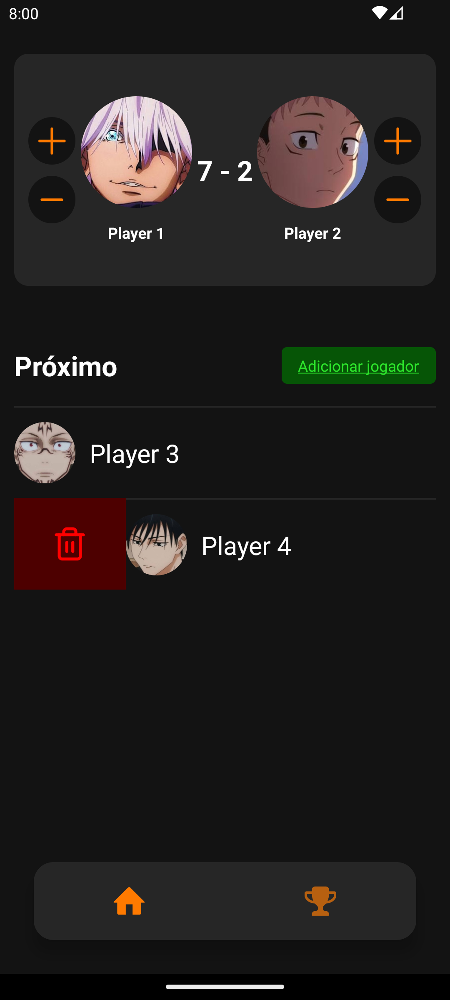
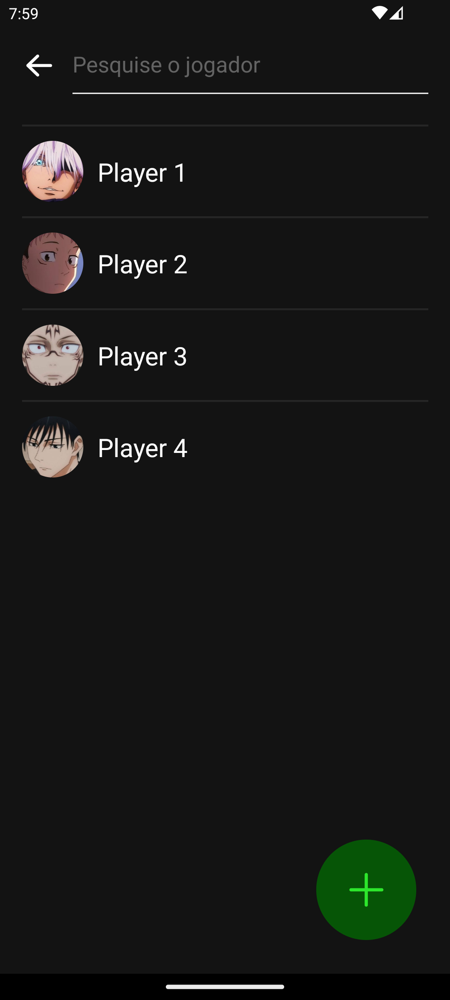
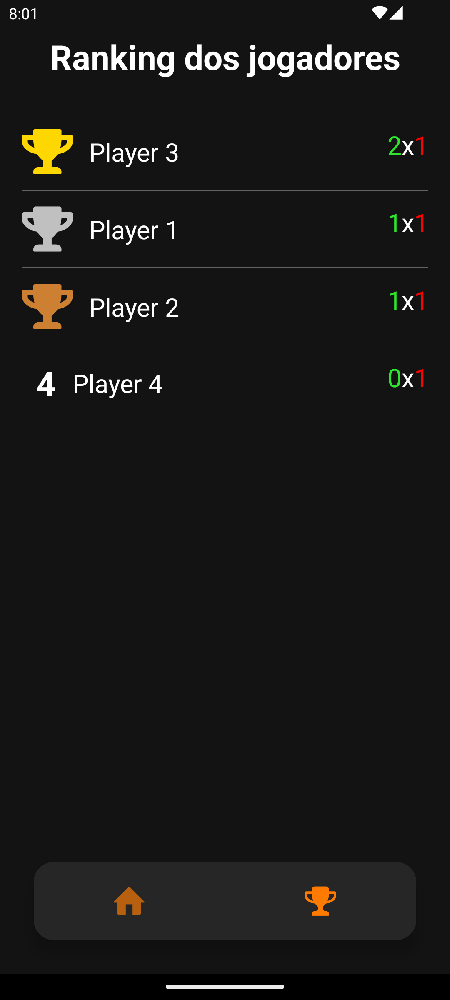

# Who's the next?


Este projeto pessoal tem como objetivo aprender sobre a biblioteca Restyle. O tema para esta aplicação é solucionar o problema da fila de espera para jogar Ping-pong em minha escola.


## Capturas de Tela





## Funcionalidades Principais

- **Adicionar jogadores**: É possível criar novos jogadores para que possam entrar na fila.
- **Rotatividade de jogador**: Com os jogadores na fila, é possível fazer a rotatividade onde somente o prócimo jogador pode entrar no lugar de quem perdeu.
- **Remover de jogador**: É possível tanto remover os jogares somente da fila quanto excluir do banco de dados.
- **Ranking**: É possível visualizar as vitórias e derrotas dos jogadores na tela Ranking.

## Instalação

Forneça instruções de como instalar o seu aplicativo. Por exemplo:

1. Clone este repositório: `git clone https://github.com/seu-usuario/seu-aplicativo.git`
2. Navegue até o diretório do projeto: `cd seu-aplicativo`
3. Instale as dependências: `npm install`
4. Inicie o aplicativo: `npm start`

## Como Usar

Para utilizar o aplicativo basta fazer a instalação do apk na pasta **github/apk** ou clonar o projeto com os seguintes passos
```
git clone https://github.com/Vinicius-B-Leite/whos-the-next.git
npm install
npx expo run:[android | ios]
```

## Tecnologias Utilizadas

- expo: 49.0.13,
- react-native-mmkv: 2.10.2,
- @shopify/restyle: 2.4.2,
- @react-navigation/native: 6.1.8
- jest: 29.7.0
- @reduxjs/toolkit: 1.9.7
- react-native-draggable-flatlist: 4.0.1,
- react-native-gesture-handler: 2.12.0,
- react-native-reanimated: 3.3.0


Feito com <3 por [Vinicius B Leite](https://www.linkedin.com/in/vinicius-b-leite/)


